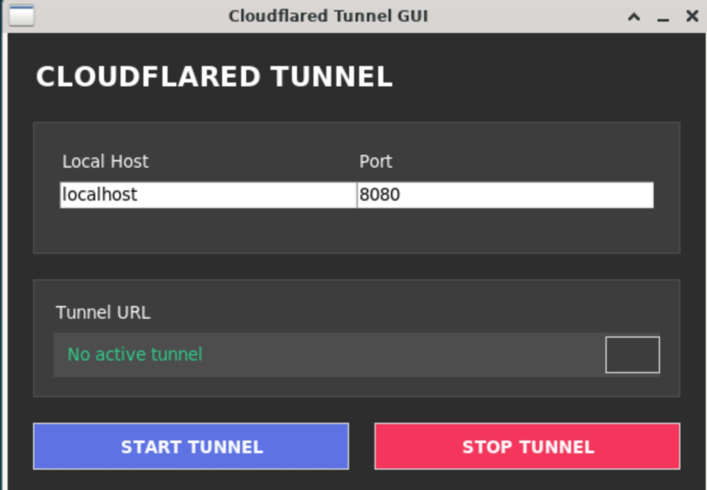

# Cloudflare Tunnel GUI

A stylish graphical interface for creating and managing Cloudflare tunnels using `cloudflared`.

 *(Add screenshot after testing)*

## Features

- Simple one-click tunnel creation
- Clean, modern dark theme interface
- Copy tunnel URL to clipboard with one click
- Automatic cleanup of log files
- Cross-platform support (Windows/Linux/macOS)

## Requirements

- Python 3.x
- `cloudflared` installed and in system PATH
- Python packages: `psutil`, `requests`

## Installation

1. Clone this repository:
```bash
git clone https://github.com/Keyaru-code/Cloudflare-GUI.git
cd Cloudflare-GUI
```

2. Install dependencies:
```bash
pip install psutil requests
```

3. Make sure you have `cloudflared` installed:
- Download from [Cloudflare's website](https://developers.cloudflare.com/cloudflare-one/connections/connect-apps/install-and-setup/installation/)
- Or install via package manager (Linux/macOS)

## Usage

Run the application:
```bash
python cloudflare-gui.py
```

### How to Use:
1. Enter your local host (default: localhost)
2. Enter port number (default: 8080)
3. Click "START TUNNEL"
4. Wait for the URL to appear
5. Click the copy button to copy the tunnel URL
6. Click "STOP TUNNEL" when finished

## Troubleshooting

If you encounter issues:
- Make sure `cloudflared` is properly installed
- Check your internet connection
- Verify the local service is running on the specified port
- Try running with administrator/sudo privileges if needed

## License

MIT License

## Credits

Made with ❤️by :- 
keyaru-code
Alienkrishn 
